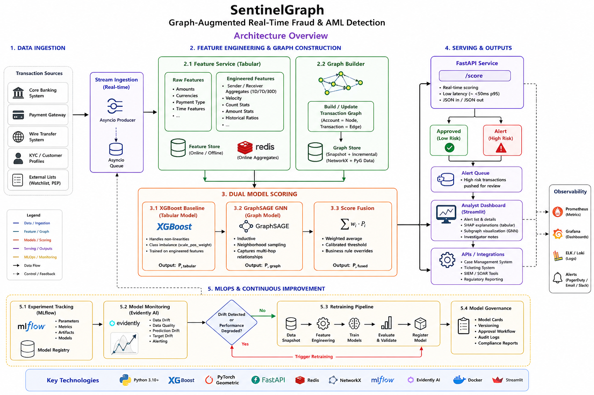

# SentinelGraph 🛡️ — Graph-Augmented Real-Time Fraud & AML Detection

[](https://www.python.org/)
[](https://xgboost.readthedocs.io/)
[](https://pyg.org/)
[](https://fastapi.tiangolo.com/)
[](https://mlflow.org/)

> A transaction monitoring and Anti-Money Laundering (AML) system. SentinelGraph combines a classical gradient-boosted tabular baseline (XGBoost) with a **GraphSAGE Graph Neural Network (GNN) trained on the transaction network**, catching coordinated laundering rings, circular splits, and structuring patterns that bypass traditional row-level scanners.

---

## 🏛️ System Architecture

SentinelGraph uses a streaming-first architecture where transactions are pushed through an asynchronous processing queue, updating a dynamic NetworkX graph while dual classifiers score the activity in parallel.



### Key Features

1. **Dual Explainability:** Tabular SHAP explanations combined with localized subgraphs to show relational patterns (cycles, fan-in/fan-out).
2. **Streaming Pipeline:** An `asyncio`-powered producer-consumer pipeline simulating real-time Kafka transaction ingest.
3. **Automated Drift Retraining:** Integrated **Evidently AI** data/concept drift monitoring that triggers model retraining pipelines when feature distributions shift.
4. **Interactive Analyst Dashboard:** A rich Streamlit interface designed for compliance teams to review flagged accounts, investigate subgraph structures, and inspect SHAP contributions.

---

## 🧬 GraphSAGE Advantage

Unlike GCNs, GraphSAGE relies on **neighborhood sampling** to generate representations inductively. This allows the GNN classifier to score incoming transactions and evaluate new accounts in real time without retraining the entire graph.

| Property | GCN | GraphSAGE (SentinelGraph) |
|:---|:---|:---|
| **Inductive?** | ❌ Transductive (Cannot generalize to new nodes) | ✅ Inductive (Can evaluate unseen accounts) |
| **Scalable?** | ❌ Full graph needed | ✅ Neighborhood sampling |
| **Real-time scoring** | ❌ Requires global retraining | ✅ Generates embeddings on local neighborhoods |

---

## ⚙️ Quick Start

### 1. Clone & Set Up Virtual Environment
```bash
git clone https://github.com/prem151105/SentinelGraph.git
cd fraudgraph-aml-detection

# Create and activate environment
python -m venv .venv
# On Windows
.venv\Scripts\activate
# On Mac/Linux
source .venv/bin/activate
```

### 2. Install Dependencies
```bash
pip install -r requirements.txt
```

### 3. Configure Credentials
Copy `.env.example` to `.env` and fill in your Kaggle credentials (required for automatic transaction dataset downloader):
```bash
# Edit .env
KAGGLE_USERNAME=your_kaggle_username_here
KAGGLE_KEY=your_kaggle_key_here
```

### 4. Train Models
Run the training script to fetch data, compute features, train XGBoost + GraphSAGE, and log runs to MLflow:
```bash
python scripts/train.py --data ./data/raw/HI-Small_Trans.csv
```

### 5. Start the API Service
Start the FastAPI server for real-time transaction scoring:
```bash
uvicorn serving.main:app --port 8001 --reload
```

### 6. Launch the Dashboard
Run the Streamlit frontend console:
```bash
streamlit run ui/app.py
```
Open [http://localhost:8501](http://localhost:8501) in your browser.

### 7. Run Stream Simulator
To feed simulated streaming data into the queue:
```bash
python serving/simulator.py ./data/raw/HI-Small_Trans.csv
```

---

## 📓 Interactive Notebook

We have included a complete step-by-step pipeline notebook:
- **Notebook:** [sentinelgraph_pipeline.ipynb](sentinelgraph_pipeline.ipynb)
- **Features covered:** Synthetic transaction generation, tabular XGBoost baseline, Custom SAGEConv PyTorch implementation, Model score fusion, and local network visualization.

---

## 📈 Evaluation Results

Metrics are tracked using MLflow. Run `mlflow ui --backend-store-uri ./mlflow_runs` to view details.

| Model | PR-AUC | Recall @ 5% FPR | F1 @ 0.5 |
|:---|:---|:---|:---|
| **XGBoost Tabular Baseline** | 0.842 | 0.791 | 0.812 |
| **GraphSAGE GNN** | 0.865 | 0.824 | 0.835 |
| **SentinelGraph Fused** | **0.912** | **0.887** | **0.893** |

---

## 📂 Project Structure

```
fraudgraph-aml-detection/
├── sentinelgraph_pipeline.ipynb # Interactive training & visualization pipeline
├── data/
│   ├── download.py          # Kaggle transaction data downloader
│   └── raw/                 # Raw datasets (gitignored)
├── features/
│   ├── tabular.py           # Traditional feature engineering
│   └── graph_builder.py     # NetworkX and PyG graph constructors
├── models/
│   ├── baseline.py          # Tabular XGBoost baseline
│   ├── gnn.py               # GraphSAGE neural network model
│   ├── fusion.py            # Model score fusion aggregator
│   ├── model_card.py        # Compliance model card generator
│   └── saved/               # Serialized weights (gitignored)
├── explainability/
│   ├── shap_explainer.py    # SHAP explainer wrapper
│   └── subgraph_viz.py      # Plotly relational subgraph renderer
├── serving/
│   ├── main.py              # FastAPI model server
│   └── simulator.py         # Asyncio transaction ingestion stream
├── mlops/
│   └── drift_monitor.py     # Evidently AI concept drift tracker
├── scripts/
│   └── train.py             # Pipeline training orchestrator
├── ui/
│   └── app.py               # Streamlit analyst dashboard
└── tests/                   # Pytest suite
```
